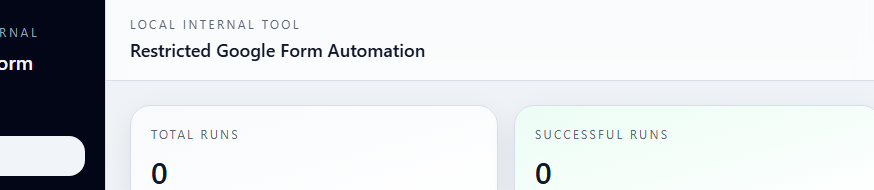
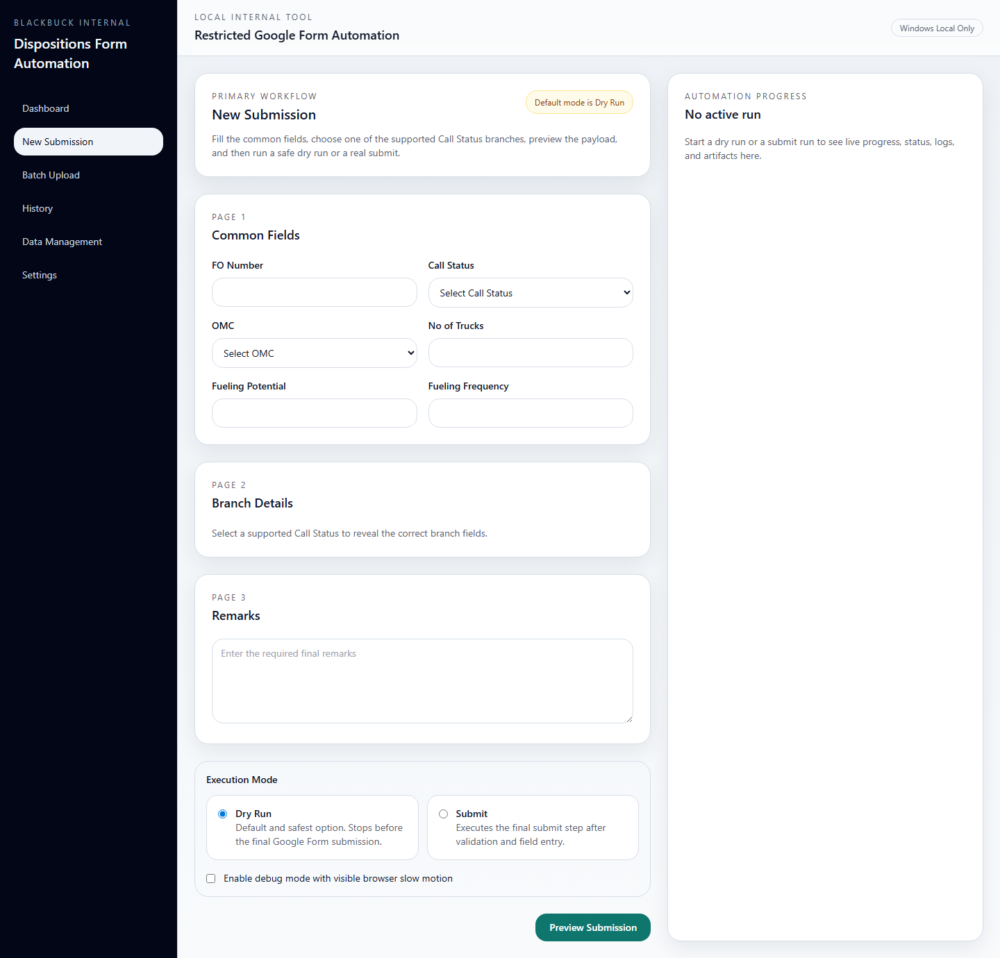
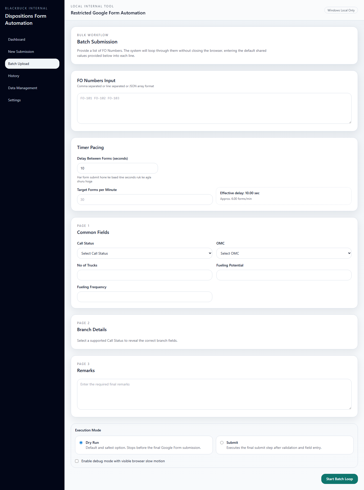
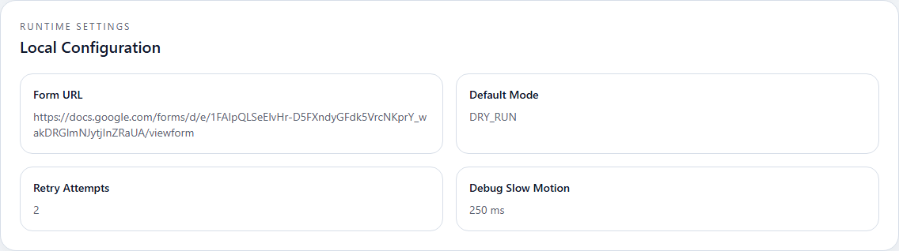

# Dispositions Form Automation

Windows-local Next.js + Playwright tool to automate a restricted Google Form with saved browser-session reuse, single submission flow, batch submission flow, run history, screenshots, logs, and local artifact storage.

## What This App Does

- Opens a dashboard-driven website on your local machine
- Reuses a manually authenticated browser session instead of storing credentials
- Submits supported Google Form flows through Playwright
- Supports:
  - single submission
  - bulk submission
  - auth setup / refresh
  - history tracking
  - local storage cleanup
- Stores runtime data in `storage/`

## Website Pages

- `/dashboard`
  - auth status
  - today run stats
  - active work summary
  - recent submission and batch history
- `/submissions/new`
  - single form submission flow
  - branch fields based on `Call Status`
  - preview before live run
- `/batch`
  - bulk FO number submission
  - pacing control
  - shared values reused across rows
- `/history`
  - completed runs and batch history
- `/settings`
  - auth setup buttons
  - live runtime config view
- `/data-management`
  - clear history, logs, artifacts, sample data, and batch state

## Screenshots

### Dashboard



### New Submission



### Batch Submission



### Settings



## Tech Stack

- Next.js App Router
- TypeScript
- Playwright
- React Hook Form
- Zod
- Local JSON-based storage

## Project Structure

```text
src/
  app/
    dashboard/
    submissions/new/
    batch/
    history/
    settings/
    data-management/
    api/
  components/
  lib/
  modules/
  server/
config/
storage/
public/
tests/
scripts/
```

## Prerequisites

- Windows machine
- Node.js 20+
- npm 10+
- Playwright Chromium installed
- Access to the restricted Google Form
- Authorized Google account for manual login setup

## Environment Setup

This repo now includes a local `.env.local` with the important runtime variables already added.
The file is ignored by Git.

If you want to reset it manually:

```powershell
Copy-Item .env.example .env.local
```

### Important Variables

| Variable | Required | Example | Purpose |
| --- | --- | --- | --- |
| `APP_FORM_URL` | Yes | `https://docs.google.com/forms/.../viewform` | Google Form link used by Playwright |
| `DEFAULT_MODE` | Yes | `SUBMIT` | Configured run mode. Legacy `DRY_RUN` values are normalized by the current runtime where applicable |
| `AUTOMATION_SPEED_MODE` | Yes | `normal` | Controls typing and field pacing |
| `DEBUG_SLOW_MO_MS` | Optional | `250` | Slows Playwright in debug-friendly mode |
| `MAX_RETRIES` | Yes | `2` | Pre-submit retry attempts |
| `PERSIST_SCREENSHOTS` | Optional | `false` | Save screenshots in `storage/artifacts` |
| `PERSIST_RUN_REPORTS` | Optional | `false` | Save JSON reports in `storage/artifacts` |

### Current `.env.local`

```dotenv
APP_FORM_URL=https://docs.google.com/forms/d/e/1FAIpQLSeElvHr-D5FXndyGFdk5VrcNKprY_wakDRGlmNJytjInZRaUA/viewform
DEFAULT_MODE=SUBMIT
AUTOMATION_SPEED_MODE=normal
DEBUG_SLOW_MO_MS=250
MAX_RETRIES=2
PERSIST_SCREENSHOTS=false
PERSIST_RUN_REPORTS=false
```

## First-Time Setup

1. Install dependencies.

   ```powershell
   npm install
   ```

2. Install Playwright Chromium.

   ```powershell
   npx playwright install chromium
   ```

3. Prepare local storage files and folders.

   ```powershell
   npm run prepare:storage
   ```

4. Start the website.

   ```powershell
   npm run dev
   ```

5. Open the local app in your browser.

   ```text
   http://localhost:3000
   ```

## Full Working Flow

### 1. Start the Website

Run:

```powershell
npm run dev
```

The home route redirects to `/dashboard`.

### 2. Complete One-Time Login Setup

Do this before running a real submission.

1. Open `/settings` or `/dashboard`
2. Click `Start Login Setup`
3. A Playwright browser session opens
4. Log in manually using the authorized Google account
5. Wait until the Google Form is fully visible
6. Return to the app and click `Finish Login Setup`
7. The session is saved in:
   - `storage/auth/storage-state.json`
   - `storage/auth/auth-metadata.json`

If you make a mistake, click `Cancel`.

### 3. Run a Single Submission

Go to `/submissions/new`.

1. Fill Page 1 common fields:
   - FO Number
   - Call Status
   - OMC
   - No of Trucks
   - Fueling Potential
   - Fueling Frequency
2. Select a supported `Call Status`
3. Fill the branch fields that appear for that Call Status
4. Fill `Remarks`
5. Click `Preview Submission`
6. Confirm the preview
7. Watch the progress panel on the right
8. Review final status and artifacts if enabled

### 4. Run a Bulk Submission

Go to `/batch`.

1. Paste FO numbers
   - line separated
   - comma separated
   - or JSON array
2. Set `Delay Between Forms`
3. Optionally set `Target Forms per Minute`
4. Fill the shared fields that should be reused across every row
5. Choose the `Call Status`
6. Fill branch-specific fields
7. Fill `Remarks`
8. Click `Start Batch Loop`
9. Monitor progress in the batch panel

### 5. Review History

Go to `/history` or check the history section on `/dashboard`.

You can review:

- success / failure state
- timestamps
- single runs
- batch runs
- related artifacts and logs

### 6. Manage Runtime Data

Go to `/data-management` when you need cleanup.

You can clear:

- run history
- logs
- screenshots and reports
- batch state
- sample data
- auth session data

## Storage and Artifacts

### Important Local Paths

- `storage/auth/storage-state.json`
  - saved Playwright session
- `storage/auth/auth-metadata.json`
  - email + validation metadata
- `storage/history/runs.json`
  - single run history
- `storage/history/batch-runs.json`
  - batch run summary history
- `storage/history/batch-rows.json`
  - per-row batch results
- `storage/logs/*.jsonl`
  - structured logs
- `storage/artifacts/<run-or-batch-id>/`
  - screenshots and JSON reports

## Commands

```powershell
npm run dev
npm run build
npm run start
npm run typecheck
npm run test
npm run prepare:storage
npm run seed:sample
```

## Testing

Run:

```powershell
npm run typecheck
npm run test
```

## Manual Verification Checklist

1. `Dashboard` opens
2. `New Submission` opens
3. `Batch Submission` opens
4. `History` opens
5. `Settings` opens
6. `Data Management` opens
7. Login setup can be started and finished manually
8. One single submission completes
9. One batch submission completes
10. History updates after runs
11. Logs are written in `storage/logs`
12. Artifacts are written when persistence is enabled

## Troubleshooting

### Login setup not working

- Re-run `Start Login Setup`
- Make sure the Google account has form access
- Confirm the form page fully loads before clicking `Finish Login Setup`

### Session expired

- Open `/settings`
- Click `Refresh Status`
- If needed, run login setup again

### Batch stops midway

- Open `/history` or `/dashboard`
- Check the latest batch status
- Review logs in `storage/logs`
- Review screenshots / reports in `storage/artifacts`

### Form link changed

Update `APP_FORM_URL` in `.env.local`, then restart the dev server.

## Safety Notes

- Use only an authorized Google account
- Do not hardcode credentials in code or env files
- Do not automate the Google login form fields
- Keep this tool local and internal
- Enable screenshot/report persistence only when you need artifacts
